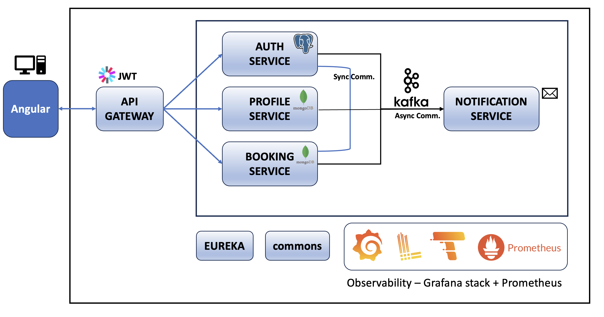

# Health Care Microservices Project

Welcome to the Health Care Microservices Project! This project is a Spring Boot-based microservices architecture for a healthcare system. It is designed to provide various services related to user registration, authentication, profile management, booking, and notifications.

## Project Architecture


## Project Structure
The project is organized into several modules, each serving a specific purpose. Below is an overview of the modules:

## Modules

### 1. Discovery Server

The `discovery-server` module is responsible for Eureka Cloud Discovery. It enables service registration and discovery within the microservices ecosystem.

### 2. API Gateway

The `api-gateway` module serves as the API gateway for the services. 
It handles requests and routes them to the appropriate microservices.

### 3. Auth Service

The `auth-service` module is dedicated to user registration, login, and authentication. It utilizes PostgreSQL as the underlying database.

### 4. Profile Service

The `profile-service` module manages user profiles and leverages MongoDB as the database solution.

### 5. Booking Service

The `booking-service` module is responsible for managing bookings and utilizes MongoDB for storage.

### 6. Notification Service

The `notification-service` module handles the sending of notifications, specifically emails. It employs Maildev for sending out emails.

### 7. Commons

The `commons` module contains shared components, including messaging DTOs (Data Transfer Objects). These DTOs are used for communication and data exchange between microservices, ensuring a standardized messaging format.

## Communication

The microservices communicate asynchronously using Kafka as the Java Message Service (JMS). 
Kafka facilitates communication between the `auth-service`/`profile-service`/`booking-service` (producers) and `notification-service` (consumer) modules.

## Database

- **PostgreSQL:** Used by the `auth-service`.
- **MongoDB:** Utilized by the `profile-service` and `booking-service`.

## Observability

Grafana, Loki, Tempo, and Prometheus are integrated for observability, providing insights into the system's performance and health.


## Running the Project via Docker

To run the project via Docker, ensure the following services are up and running:

- PostgreSQL on port 5432
- MongoDB on port 27017
- Maildev on ports 1080/1025

After confirming that the required services are active, follow these steps:

1. Navigate to the `scripts` folder in the project.

2. Generate Docker images:
   ```bash
   ./buildDockerImages.sh
   ```
3. Modify the environment variables as needed. Run the Docker Compose file:
   ```bash
   docker-compose up -d
   ```

Navigate to the following URLs.

- Eureka dashboard: http://localhost:8761
- Grafana dashboard: http://localhost:3000
- Kafka manager: http://localhost:8000